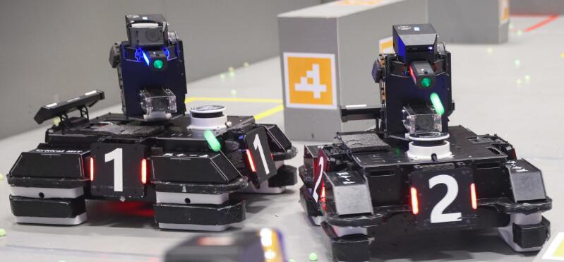

    
    <h1 align="center">哈尔滨工业大学（深圳）--Critical HIT</h1>

哈尔滨工业大学（深圳）Critical HIT战队RMUA2022开源代码库，每个库里都有单独的README.md文件，使用前请仔细阅读相关内容。

RMUA2021战队技术答辩视频链接：[RoboMaster 2021高校人工智能挑战赛八强队伍技术答辩](https://www.bilibili.com/video/BV1so4y1k7Qz)

## 文件结构
|文件夹名称|功能|
|:--|:--|
|robot_sentry|哨岗识别模块|
|robot_decision|决策模块|
|robot_detection|装甲识别模块|
|robot_omni|车端全向感知模块|
|robot_msgs|自定义的ros消息类型|

## 编译及运行
哨岗识别模块自成一体，不与其他模块一起编译。

决策模块、装甲识别模块和全向感知模块均依赖`robot_msgs`，编译时务必包含在内。

具体编译步骤参考各个模块的README。
