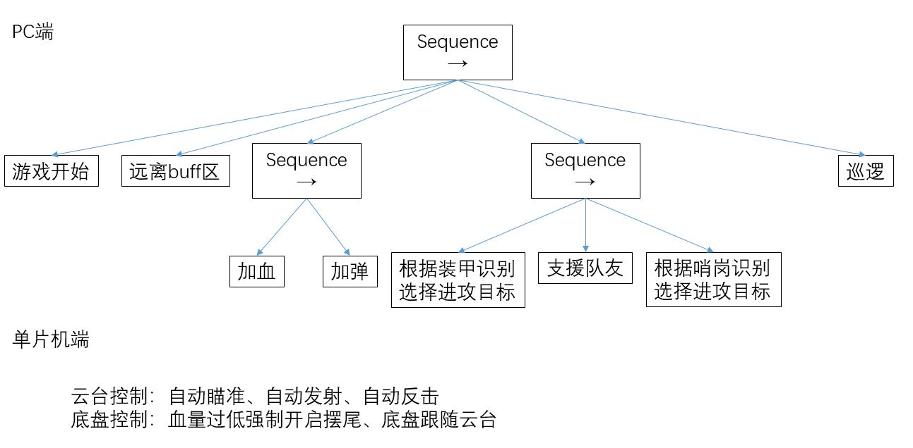
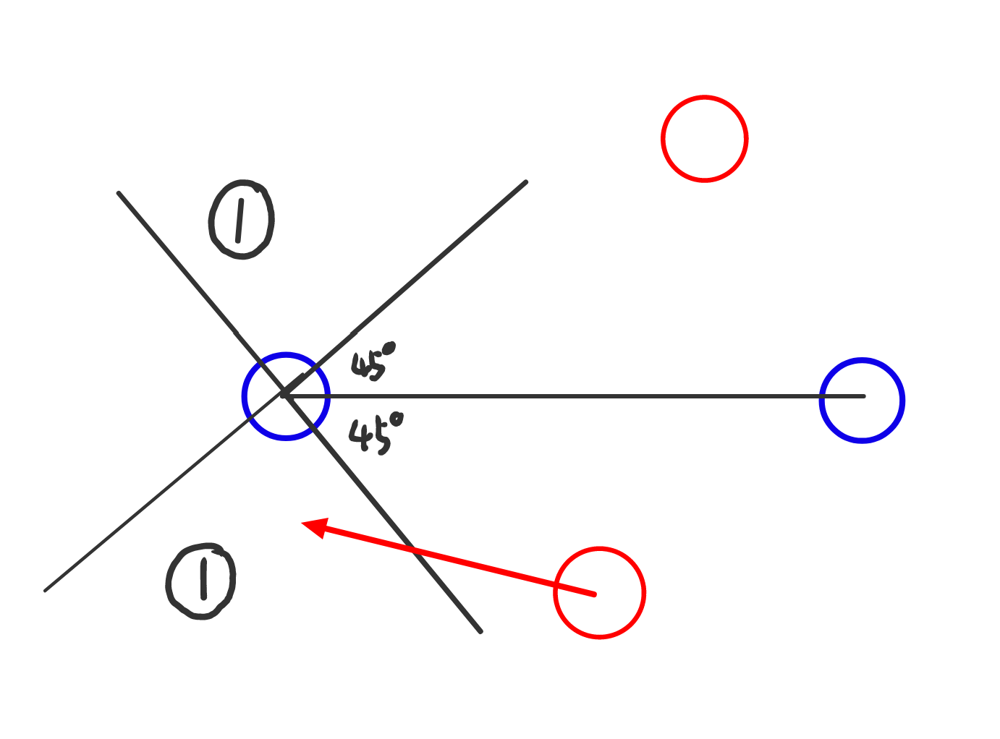
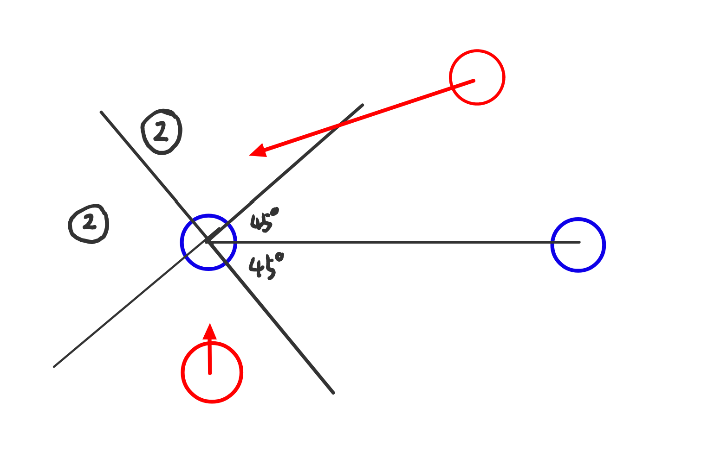
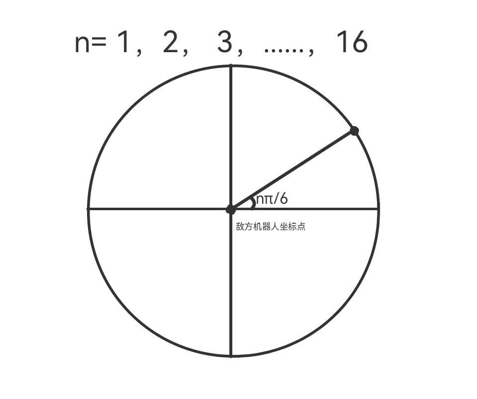

# Critical HIT ICRA2021 决策模块
## 1.文件结构
```bash
robot_decision
├── CMakeLists.txt
├── behaviors                          # 各个具体的行为
│   ├── add_blood.hpp                  # 加血
│   ├── add_bullet.hpp                 # 加弹
│   ├── attack_enemy.hpp               # 根据装甲识别选定进攻点
│   ├── game_start.hpp                 # 判断比赛是否开始
│   ├── global_map.hpp                 # 小地图进攻
│   ├── leave_buff.hpp                 # buff刷新前10秒离开buff
│   ├── patrol.hpp                     # 巡逻
│   ├── retreat.hpp                    # 没弹没血撤退
│   └── support_teammate.hpp           # 支援队友，根据队友识别的敌方数据选定进攻点
├── executor                           # 云台数据处理模块
│   ├── buff_executor.hpp              # 发指令给robot_planning控制buff区是否能去
│   ├── chassis_executor.hpp           # 发指令给robot_base控制机器人底盘运动
│   ├── log_executor.hpp               # 保存log，目前已被注释
│   ├── map_executor.hpp               # 用于融合哨岗数据和装甲检测数据，未使用
│   └── self_info_executor.hpp         # 向队友发送己方的信息
├── behavior_tree.h                    # 简单实现的行为树框架，信息打印功能有问题
├── blackboard.hpp                     # 黑板，所有数据从黑板读取
├── decision_node.cpp                  # 决策节点主函数
├── decision_node.hpp
└── package.xml
```

---
## 2. 代码说明

决策模块基于行为树搭建。行为树的结构如下图所示。



> 电脑端决策只控制底盘运动。电脑端决策的最终目的是根据场上的情况在场地中实时选择一个合适的点，即底盘要运动到的地方，并将这个点发送给路径规划模块，由其选择合适的路径。

> 云台运动则由单片机进行控制，当相机检测到敌方装甲并筛选出最优进攻目标后，由单片机控制云台转向。子弹发射也是单片机控制，单片机根据装甲板的距离改变弹丸发射频率，距离越远频率越低。

我们使用的是自己写的一个简化版的决策树，其定义在`behavior_tree.h`中，当中只有两种类型的节点，一种是顺序节点`Sequence Node`，另一种是动作节点`Action Node`。

设计行为树时主要考虑的是各个子动作之间的优先等级，或者说重要性的排序。在上图中，越靠左的动作优先级越高，即执行的顺序越靠前。比如加血加弹的优先级应该高于进攻，因为有血有弹是进攻的本钱。

黑板定义在`blackboard.hpp`中，是一个公共数据区，负责接收其他所有节点的数据，包括来自裁判系统、定位、规划、哨岗、视觉等的信息，并在这里将数据进行初步处理，供所有的行为节点获取这些处理后的数据来决策。

决策的各个行为代码在`behaviors`文件夹中，具体功能如下描述：
### 1. game_start
此节点用来判断比赛是否开始，若比赛未开始则原地等待，若比赛开始则跳过该节点，执行后续行为。
### 2. add_blood
此节点用来判断是否需要加血以及给出需要加血时要去的位置。当自己血量较少或本队总体血量较少、且本队加血buff区未被刷掉时，去往加血buff区。
### 3. add_bullet
此节点由来判断是否需要加弹以及给出需要加弹时要去的位置。加弹行为在不同的时间段会有些不同，在比赛刚开始时，自己除加弹外，还有刷掉敌人加血区、阻挡敌方机器人加弹等，最高效率利用比赛刚开始时双方子弹都不足的这段时间。之后buff刷新后，己方机器人只有在己方子弹数不足的情况下采取加弹。
### 4. retreat
此节点用来撤退。当自己状态较差且无法回血回弹时，在四个启动区中选择距离其他机器人都较远的一个作为撤退点。将四个启动区作为预选撤退点，我们通过机器学习训练出来的。
### 5. global_map
小地图进攻。通过小地图发送的信息，两车分别去到合适的位置以达成围攻同时防止被对方绕后，在此处有较为简陋的被绕后时的躲避行为（可继续改进）。




### 5. attack_enemy
此节点用来寻找进攻敌方机器人的最优位置坐标。首先通过相机找到敌方机器人的装甲板位置并通过解算变换到全局坐标系，然后在敌方机器人的坐标周围给出一定数量的预选点，在这些预选点中筛调不可去的点如在场地外或惩罚buff区的点，再选择离自己最近的点。该选点模型图像表示如下图

### 6. support_teammate
此节点用来支援队友。支援队友需要满足一定的条件，如队友存活且队友有识别到敌方机器人，此时自己的选点模型与attack_enemy中的选点模型相似，只是将最后取的点改为离队友最远的点，以便形成包围的局势，能打出更大程度的伤害。
### 7. patrol
此节点用来场地巡逻。当机器人未找到敌方机器人且队友也未找到时，己方机器人先去刷掉己方的加血加弹buff，再依次前往场地预选的六个点，以便将视野覆盖到整个场地，保证识别到敌方机器人。

决策的执行方式通过向其他节点发送指令的形式进行。这些代码在`executor`文件夹中，具体功能见上述的文件结构描述。
### 1. buff_executor
将全场六个buff区的信息发送给路径规划模块，告诉其哪些buff区可经过，哪些buff区不可经过。
### 2. chassis_executor
将底盘要去的位置和怎样过去均发布给路径规划模块，由其决定最终的路径。
### 3. self_info_executor
用来与队友进行通信，通信的内容包括自己的位置、自己识别到的敌人的位置、自己要去的buff点等等，使己方的两个机器人能够更好的协作。

---

## 3. 配合
我们使用自制的无限模块进行两台机器人之间的通信，保证能够在比赛中实时接收到队友血量、剩余子弹数、要去的buff区等信息，以便打出更好的配合战。

---

## 4. 依赖
决策模块于`robot_base`节点、`robot_planning`节点、`robot_localization`节点和`robot_msgs`节点。

---

## 5. 网盘资料
相关图片、模拟器内仿真视频和队内模拟赛演示视频在网盘中，可自行观看。

网盘链接：[https://pan.baidu.com/s/1tJFHQz7n4rUoEM1BvWM4Fg](https://pan.baidu.com/s/1tJFHQz7n4rUoEM1BvWM4Fg)，提取码：84wc。
