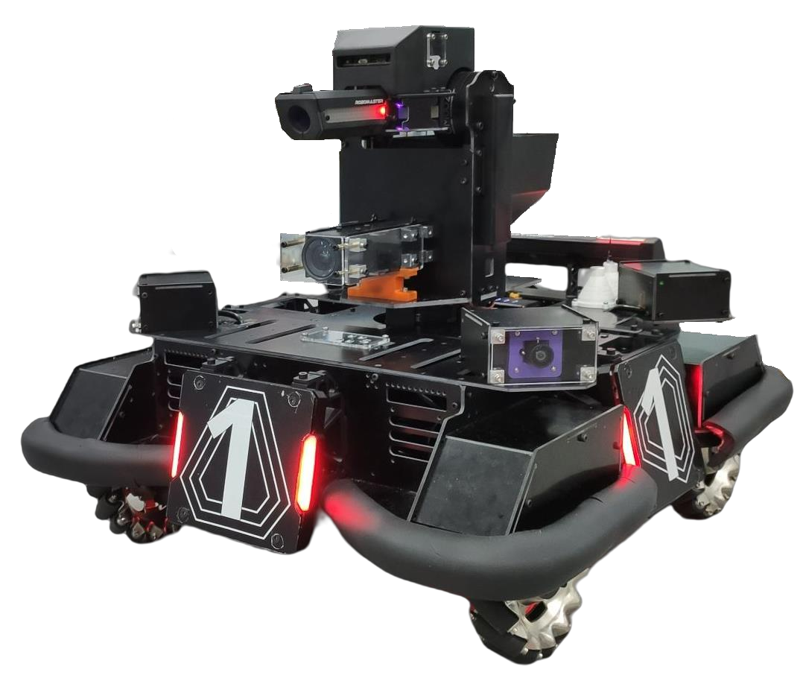
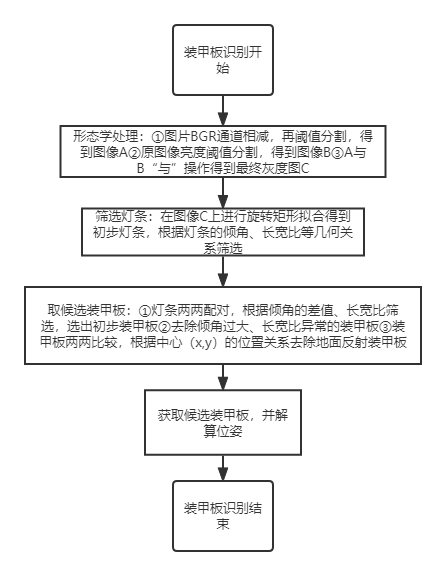
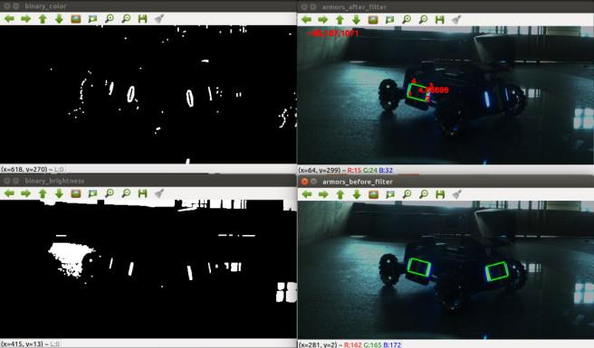
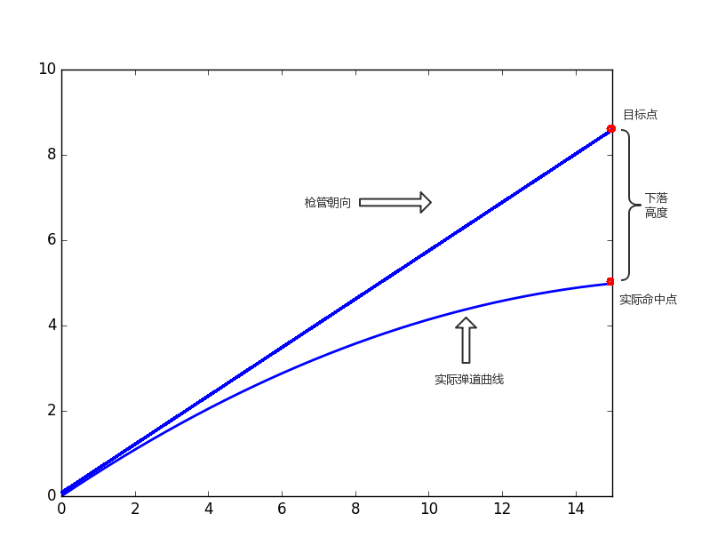
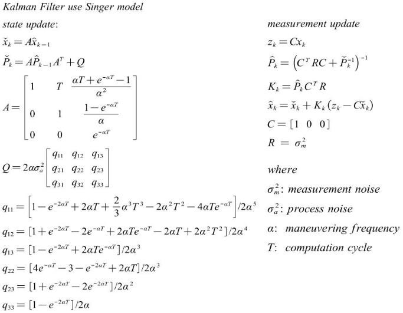
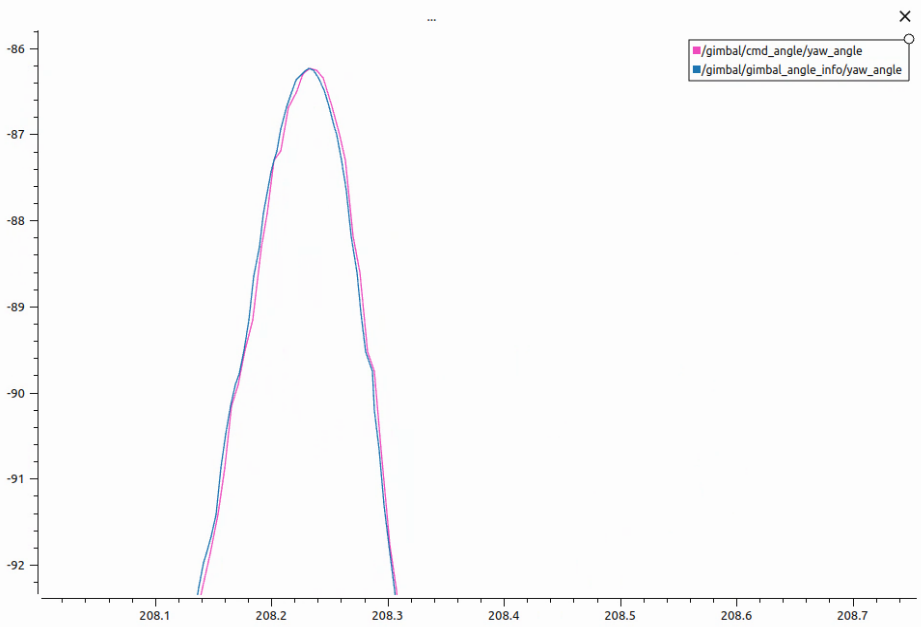
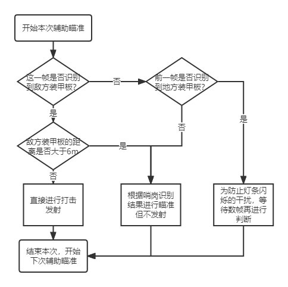
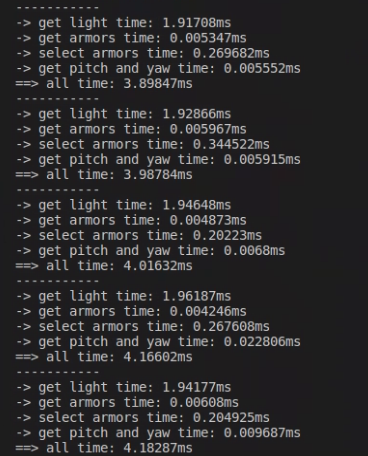

# Critical HIT RMUA 辅瞄模块


## 1、硬件及依赖环境

#### 车辆图片




#### 硬件

车载相机用于检测敌方装甲模块，需要快速、稳定的识别方案。因此用于识别装甲需要高帧率、功能稳定的相机。另外因为装甲检测算法是通过对装甲模块两边的灯条的几何关系进行检测的，为了实现更好的检测效果， 我们需要能够调节相机的曝光度和亮度等。基于上述需求，我们选择了迈德威视的MV-SUA133GC-T 型号的 USB3.0 彩色工业相机，体积小，支持 PC Linux 系统，可支持输出 24bit RGB 图像数据。


#### 依赖环境


1.*ros（机器人操作系统）*

整个工程都是基于ROS的软件框架，实现模块单独的测试，模块之间的通信、配合。


2.*OpenCV4*

OpenCV库主要用来进行图像的形态学处理以及几何特征的处理。


3.*Eigen*3

运用Eigen库主要进行基本线性代数算法比如卡尔曼滤波中矩阵运算等。


4.*robot_msgs*

自定义消息包，实现各模块之间通信。

## 2、软件介绍和代码说明

​自瞄模块的功能是获取敌人位姿信息，实现自动控制云台，跟踪击打装甲板，模块主要分为三个部分：
1. 装甲识别；
2. 云台转动角计算及卡尔曼滤波预测；
3. 辅助瞄准。

其中，装甲板检测完全基于传统的OpenCV算法实现，采取传统的灯条检测方案，主要步骤分为筛选灯条、灯条组合装甲、筛选装甲三个步骤。最终自瞄第一人称效果如下：

<p align="center">


### 1.文件结构

```bash
robot_detection
├── CMakeLists.txt
├── camera_param                    	     #相机内参
├── armor_detect                    	    	# 装甲识别
│   ├── armor_detection.cpp
│   └── armor_detection.h
├── gimbal_control                   		  # 云台转动角度计算，内含抛物线模型
│   ├── gimbal_control.cpp
│   └── gimbal_controls.h
├── kalman_filter                      			 # 卡尔曼滤波库
│   ├── CMakeLists.txt
│   ├── kalman_filter.cpp
│   └── kalman_filter.h
├── launch                              				# launch文件
├── detection_node.cpp                  # 主函数
├── detection_node.hpp
└── package.xml
```


### 2. 代码结构

辅瞄模块主要包括装甲检测和辅助瞄准两部分。

#### 装甲检测

装甲检测部分使用传统CV算法，我们只检测灯条，没有识别数字，因此相机曝光时间调的很短，大体思路与[官方开源代码](https://github.com/RoboMaster/RoboRTS)一致，先二值化然后提取轮廓，然后根据几何关系对轮廓进行拟合筛选，最后组合成装甲，根据装甲的角点进行PnP解算，得到装甲板的坐标。



- 装甲板识别过程及效果如图：左上是通道相减阈值分割结果，左下是亮度阈值分割结果，右下是初步装甲板，右上是结果装甲板。



<p align="center">


这一部分代码在`armor_detect`文件夹下。

#### 自瞄优先级

我们在每一轮装甲检测之后都会保存上一轮目标装甲的中心的在图片中的坐标(x,y)。然后，先是根据本轮候选装甲板中心的坐标，遍历比对，找到距离上一轮目标装甲板最近的装甲板A，判断为同一块装甲板，同时找到距离自身最近的一块装甲板B。之后进行下一轮比对，如果A和B相距本车的距离差不多，则瞄准A；如果B的距离明显小于A的距离，则瞄准B。

这一部分代码在`armor_detect`文件夹下。

#### 弹道模型和云台角度解算

- 弹道模型使用的是官方开源代码中的抛物线弹道模型，调试的时候有两个参数：发射速度和空气阻力系数。模型在`gimbal_control.cpp`中有所体现。具体弹道模型可参考文件夹中的`弹道模型.pdf`文件。

  这一部分代码在`gimbal_control`文件夹下。



- 云台角度解算使用图像中装甲的四个顶点，结合装甲的实际尺寸进行 PnP 解算获取到装甲相对于云台转轴的坐标位置，根据几何关系计算出yaw 轴和 pitch 轴的角度。

- 卡尔曼滤波实现云台角度跟随，视觉识别的结果通常带有噪声和延迟，我们希望能够从具有噪声的结果中估计出敌方机器人的速度，此时便能用上卡尔曼滤波来实现预测估计，达到自动跟随瞄准的目的。卡尔曼滤波器的设计如下图：

  

​				

- 卡尔曼滤波的效果图如下：红色曲线是上层卡尔曼滤波后发布的角度，蓝色曲线是云台反馈的角度，基本能够实现很好地预测跟随。

<p align="center">


#### 辅助瞄准

我们的辅助瞄准有两种模式，一种是根据装甲识别结果进行瞄准，一种是根据哨岗识别结果进行瞄准，其中装甲识别瞄准的优先级高，两者之间的切换逻辑简要说明就是识别到装甲板之后，先判断是否在视野里找到敌人装甲板，如果没找到就用哨岗识别结果进行全地图瞄准；如果在视野中找到了敌人装甲板，判断距离是否少于6m，是的话就根据装甲板识别结果进行瞄准，否的话就根据哨岗识别结果进行瞄准；如果前一帧发现敌人，这一帧敌人小消失，为防止灯条的击打闪烁则等待几帧。



具体逻辑实现可见`detection_node.cpp`中。


### 3.参数

- 相机内参

用于pnp解算目标装甲板的位姿，这部分在`camera_param`文件夹下。

- 装甲板识别参数

主要是对图片进行形态学处理的阈值以及装甲板筛选条件的阈值，主要需要调整参数有

| 参数名称                                           | 参数含义                              |
| -------------------------------------------------- | ------------------------------------- |
| enemy_color                                        | 敌人颜色，需要上场前设定              |
| red_brightness_threshold/blue_brightness_threshold | 针对红色/蓝色的亮度分割阈值           |
| red_threshold/blue_threshold                       | 通道分离后红色/蓝色图像的二值分割阈值 |

这部分参数直接在`robot_detection.launch`文件中更改。

- 弹道模型参数

主要需要调整参数是发射速度`bullet_init_v`和空气阻力系数`bullet_init_k`。

这部分参数主要在`robot_detection.launch`文件中更改。

  

### 4.各模块运行速度

- 测试所用电脑配置：CPU Intel® Core™ i7-1165G7 ,GPU NVIDIA GeForce RTX 2060

- 整套代码耗时：4ms左右

- 主要模块耗时：

  ​	1.获取灯条:1.9ms左右

  ​	2.配对灯条获取装甲板:0.005ms左右

  ​	3.筛选装甲板及位姿解算:0.25ms左右

  ​	4.计算云台转角:0.02ms以下
  
  


## 3、 代码编译、运行说明

测试需要配合播放rosbag或者自行发布图像话题`/mvsua_cam/image_raw1`。

单独运行测试：进入工作空间，运行节点，播放rosbag

```bash
catkin_make
source devel/setup.bash
roslaunch robot_detection robot_detection.launch
rosbag play test.bag
```

## 4、网盘链接
网盘中提供了用于演示功能的rosbag。链接：[https://pan.baidu.com/s/1EDhP30KD0Ao7wxOlbpj_VQ](https://pan.baidu.com/s/1EDhP30KD0Ao7wxOlbpj_VQ?pwd=ft9k)，提取码：ft9k。
