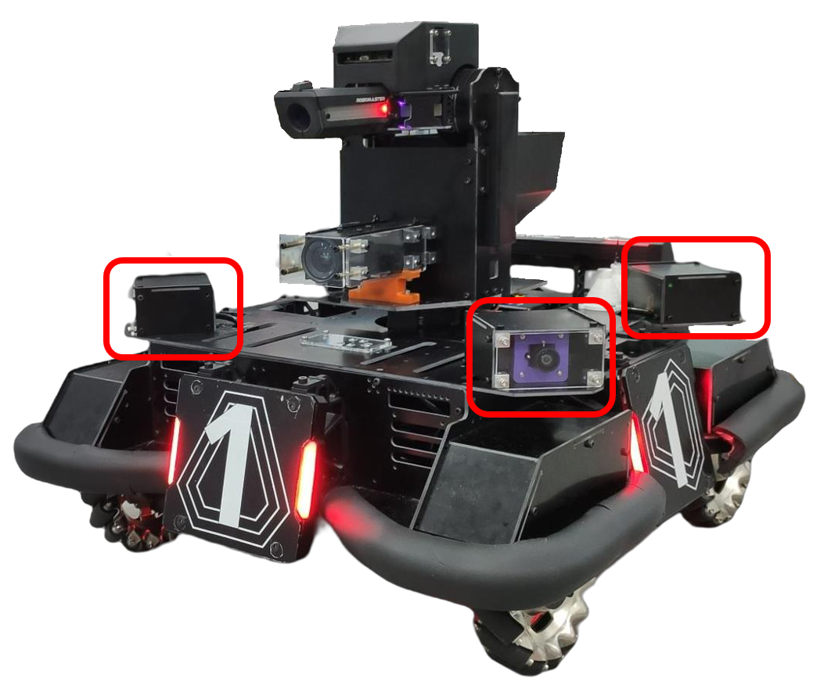
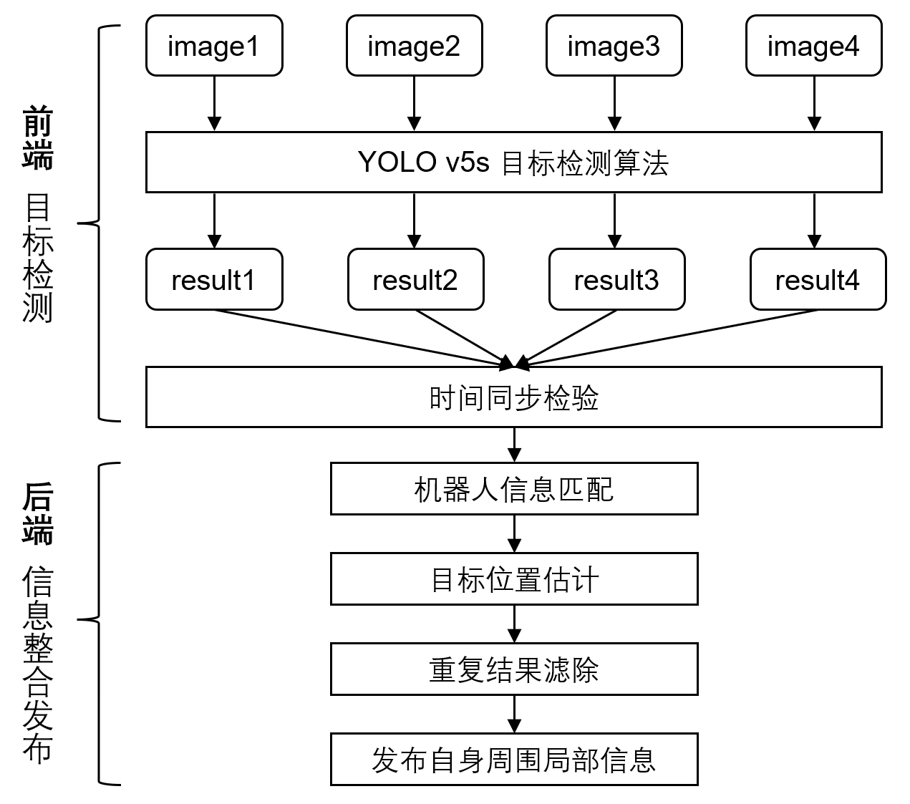
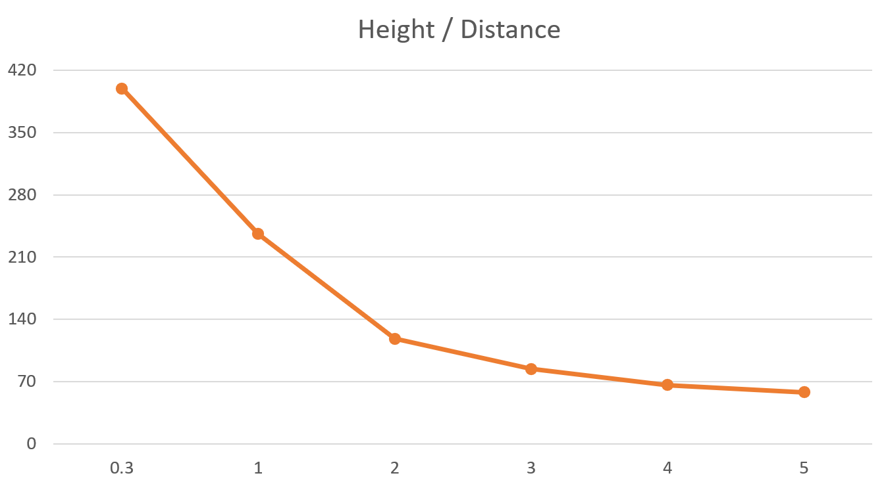

# 机器人端全向感知模块

## 目录

- [软件功能介绍](#软件功能介绍)
- [依赖环境及运行方式](#依赖环境及运行方式)

## 软件功能介绍

机器人端全向感知模块通过安装在机器人上的四个相机，搭配广角镜头可以获取机器人周围的全向视野，通过检测周围的机器人和装甲板，可以辅助规划和决策模块完成动态避障，防绕后等行为。由于通信受限等原因，机器人可能无法稳定地接收来自哨岗的信息，这时候机器人的自主感知能力就显得尤为重要。全向感知模块的检测功能与哨岗类似，但它可以让机器人在不依赖外界信息输入的条件下仍具备一定的自主感知能力，使其更加智能化。另外，由于增加了一个检测信息来源，在机器人接收到的哨岗信息出现明显错误时，可以利用机器人端的全向感知模块及时进行纠正，使整个感知系统更加稳定可靠。




### 1 全向感知系统流程

全向感知系统的整个流程可以大致分为两部分：前端目标检测和后端信息整合。在前端，使用4个subscriber分别订阅四个相机图像话题，在这四个回调函数里分别对图像进行检测，使用tensorRT部署YOLO v5s目标检测模型，把当前图像的时间戳和检测结果保存下来。对四个图像的时间戳进行同步判断，保证四个相机的检测结果是近似同一时间获得的。对检测结果中的信息进行整合，提取出真实的机器人结果并对其进行位置估计，最后把多个相机中检测到的重复机器人结果滤除掉，得到最终的自身周围信息并发布。



### 2 YOLO v5检测算法的训练与部署

我们制作了包含600张样本的数据集，标注了机器人和装甲板类别。使用YOLO v5s模型训练，参考了开源项目[tensorRT_Pro](https://github.com/shouxieai/tensorRT_Pro)的部署方案。我们的机载计算设备为nuc幻影峡谷11代i7+2060独显，在实际测试中，对于640×640的输入图片，使用FP16精度tensorRT加速后推理一张图片仅耗时2.8ms，可以满足实时性的要求。

### 3 机器人信息匹配

把检测结果中的robot和armor分离，如果是真实的机器人，那么一定是一个robot框内包含若干个armor框的形式，我们根据这一先验知识对结果进行筛选匹配，获得检测结果中的所有真实机器人。

### 4 目标位置估计

根据前面的目标检测与机器人信息匹配，我们得到了每个机器人在图像中的位置，即边界框。我们取机器人边界框的中心点像素坐标，根据相机坐标系到像素坐标系的公式，相机内参已知，只要获得机器人在相机坐标系下的深度Z，我们就能反推得到其X、Y坐标。

$$
\left\{\begin{array}{l}
u=f_{x} \frac{X}{Z}+c_{x} \\
v=f_{y} \frac{Y}{Z}+c_{y}
\end{array}\right.
$$

那这个深度Z如何获得呢，我们采用了一种Rough but Effective的办法：分段线性插值。我们很容易知道检测得到的边界框大小和目标离相机的距离是负相关的，即目标距离越近，边界框越大；目标距离越远，边界框越小。我们取机器人边界框的高度作为自变量，到相机的距离作为输出，在不同距离下进行采样，得到一条分段线性插值曲线，理论上分的段数越多这个曲线拟合越精准，但这里我只采样了5个点。有了这条曲线后，我们输入任意一个边界框高度都能得到一个近似的距离估计值，也就是深度Z。于是由上面这个公式就能得到机器人在相机坐标系下的XYZ坐标，再通过外参转换到Body系下，就获得了近似的目标位置估计。



## 依赖环境及运行方式

### 1 依赖环境

- CUDA 11.3
- cuDNN 8.2.1
- TensorRT 8.0.1.6
- OpenCV 4.2.0
- Eigen 3

### 2 运行方式

把omni_detect功能包拷贝至您的工作空间下并编译，可以在config/robot_detector.yaml文件中修改您需要的相机话题名称，也可以直接使用我们提供的rosbag进行测试。

如果您使用我们提供的rosbag：

(1)首先启动roscore，然后设置参数 /use_sim_time

```
rosparam set /use_sim_time true
```

(2)然后再启动 rosbag play 节点，加上参数 --clock以发布时钟信息，-l 用于循环播放

```
rosbag play omni_detect_test.bag --clock -l
```

(3)启动全向感知节点

```
roslaunch omni_detect robot_detector_node.launch
```

## 网盘链接
网盘中提供了用于演示功能的rosbag。链接：[https://pan.baidu.com/s/1X3mPbuscPGmnNs8ye1JiMA](https://pan.baidu.com/s/1X3mPbuscPGmnNs8ye1JiMA?pwd=neye)，提取码：neye。
