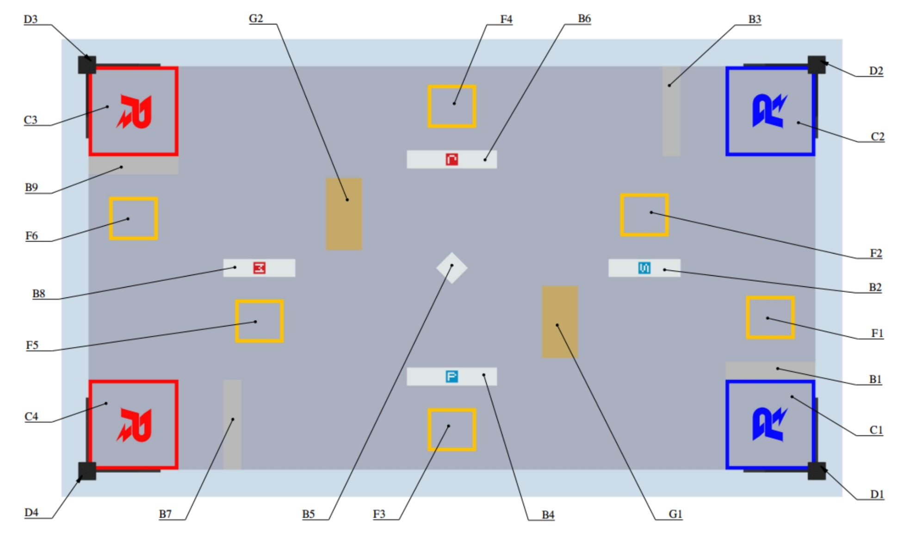
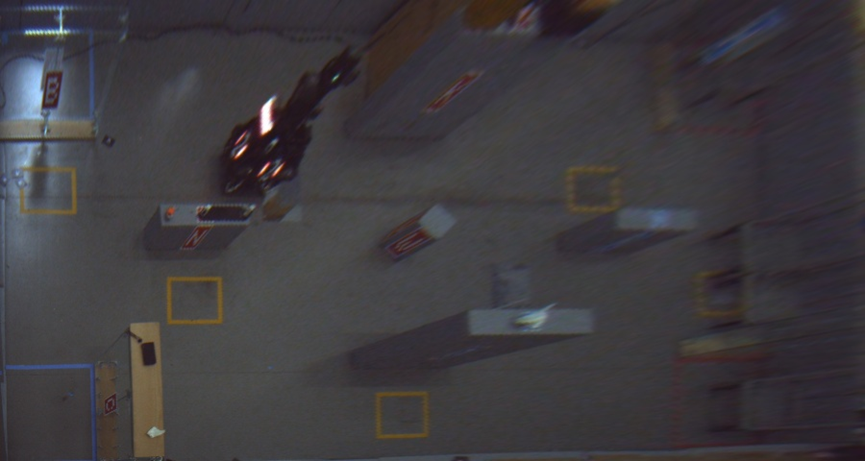
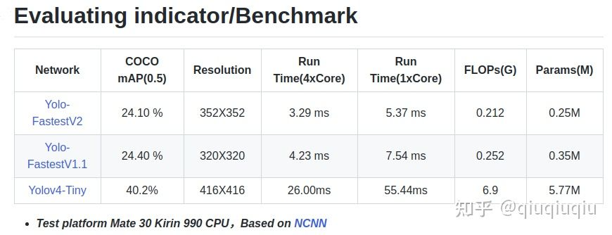
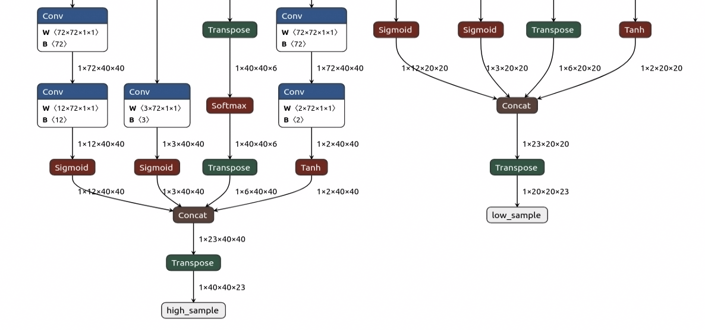
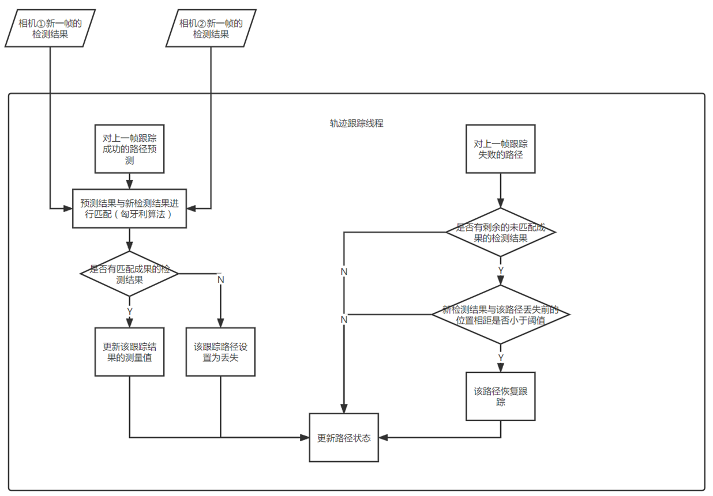
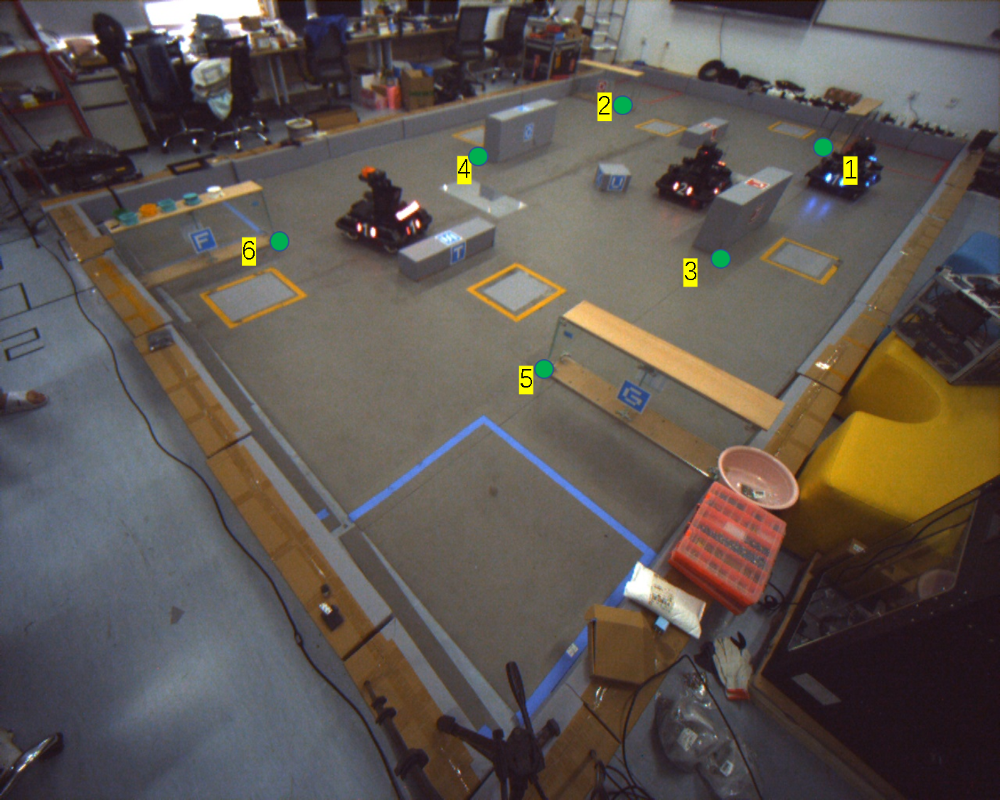
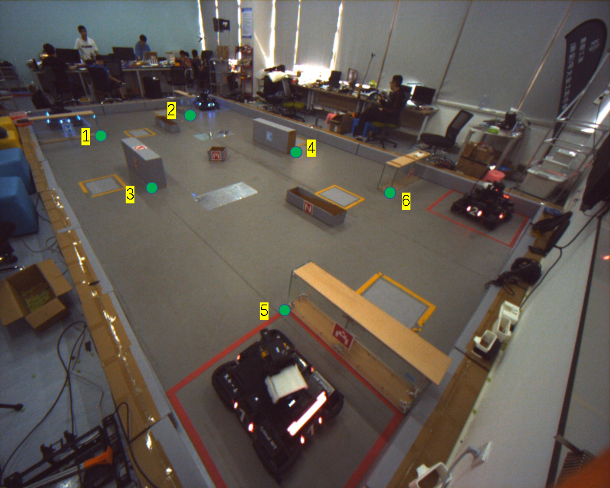
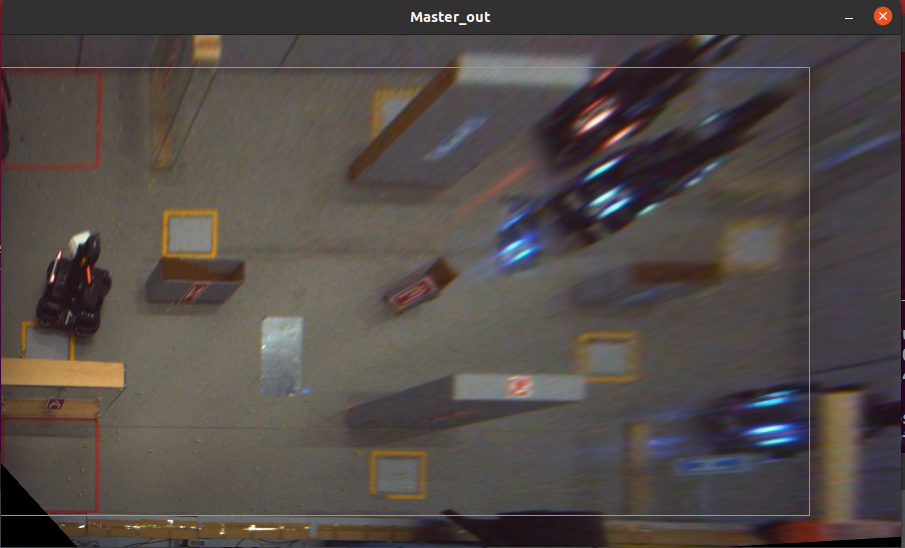
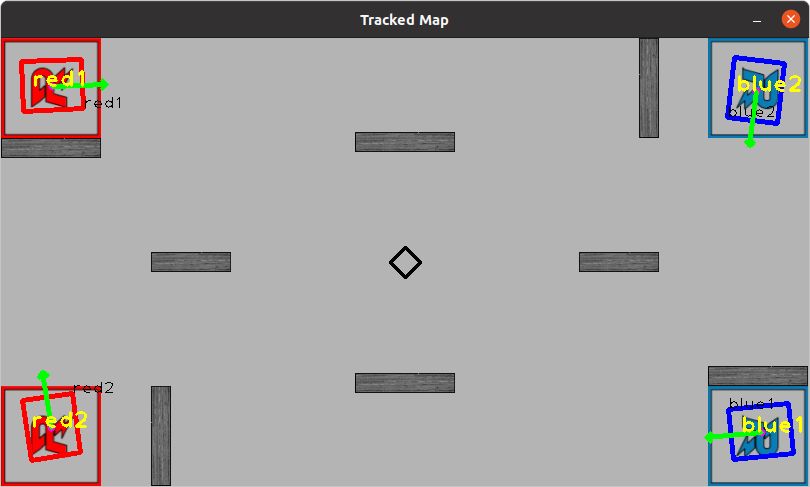
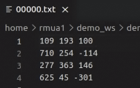

# Critical HIT 2022 哨岗模块

## 方案介绍

## 1. 方案总体简述

Critical-HIT 2022赛季哨岗模块方案主要由目标检测和目标跟踪两部分构成，目标检测部分沿用2021年方案的思路，通过单应变换获得将哨岗相机的图片转换为场地的鸟瞰图，将哨岗的任务转变为一个2D旋转目标检测，得到场上机器人的坐标与朝向；目标跟踪部分主要基于SORT算法进行改进，只维护针对敌我四个机器人跟踪器，保证场上始终有4个跟踪结果。跟踪结果包括车辆初始跟踪ID和当前检测ID、坐标、朝向的信息，在输出时利用卡尔曼滤波器降低时延，通过车端和哨岗的无线通讯将哨岗信息同步到车端小地图，用于决策和小地图自瞄。

## 2. 基本定义

### 坐标系



其中D1和D3为蓝方哨岗，D2和D4为红方哨岗，目前设置D3/D4两个位置的相机分別为蓝方、红方的 `master` camera，D1/D2两个位置相机为`slave ` camera。 master与slave相机需要严格指定，因为这关系到图像单应变换是否正确 在tools中相机标定模块和哨岗主程序模块的launch文件可以指定相机对应的哨岗ID

场地的坐标系与机器人定位节点的坐标系一致，原点为D4哨岗对应的场地直角顶点，场地长边为x轴，短边为y轴，构建右手直角坐标系。

### 通讯协议

```c++
# 车辆ID  红一 红二 蓝一 蓝二 死一 死二 分别对应 0 1 2 3 4 5
# sentry data
Header     header  # 数据头 哨岗对应数据头为0x03
uint8      id     # 无线模块ID
uint8[4]   lable  # label为两位数 十位数为当前车辆ID 个位数为跟踪的初始车辆ID
uint16[4]  x    # 机器人场内x坐标 单位mm
uint16[4]  y    # 机器人场内y坐标 单位mm
int16[4]   yaw  # 机器人yaw角 单位rad*100
```

## 3. 目标检测

目标检测部分沿用2021年方案思路，通过单应变换，利用图像坐标与场地实际障碍块坐标将哨岗相机图像转换为场地的鸟瞰图，将全场定位转换为一个2D旋转目标检测的任务





### 网络选择

为了提高哨岗信息输出帧率，网络选择上在满足精度要求的前提下使用了体积极小速度快的[yolo-fastestV2](https://github.com/dog-qiuqiu/Yolo-FastestV2)网络，



###  网络修改

参考class的格式添加角度输出头，实现对机器人朝向的检测。



哨岗相机图片输入网络后得到两个分辨率的特征图，通过NMS等后处理得到带有角度信息的Yolo格式的输出框，方便可视化调试。

修改后的网络见`pytorch`文件夹。

### 网络部署

部署上实现两套方案，使用[tensorRT_pro](https://github.com/shouxieai/tensorRT_Pro)或使用[ncnn](https://github.com/Tencent/ncnn)进行前向推理。 前者利用cuda核进行前处理与TensorRT推理加速，后者使用了vulkan进行加速，在比赛中采用前者，比赛环境下通讯帧率为40Hz。

## 4. 目标跟踪

由于鸟瞰图检测在远端效果较差，以及实际测试中发现存在车辆ID检测跳变、死车检测成活车的现象，故在目标检测的基础上加入了目标跟踪。最终哨岗输出的结果包括：初始跟踪ID，当前检测ID，车辆坐标、车辆朝向。

传统SORT算法利用检测结果与跟踪器上一帧经卡尔曼滤波预测后的结果，通过匈牙利算法利用IOU匹配进行匹配得到新的跟踪结果，此方案当目标被遮挡时会出现跟踪丢失从而出现ID switch现象。本方案针对传统SORT算法进行改进，只维护四个跟踪器，且分配时考虑距离与IOU，减少误分配。当出现跟踪丢失情况时并不删除轨迹而是等待新的检测结果直到重新分配，实现轨迹“复活”。

比赛中由于机器人碰撞挤压时出现误检测结果或者由于哨岗遭碰撞出现检测结果坐标偏移时会出现结果误分配的情况，模块会同时接收车端定位数据，如果发现我方车辆跟踪结果与车端定位结果相差较大则会进行跟踪器ID的修正。

目标跟踪算法流程图如下：



首先通过第一帧检测结果，生成四个初始的跟踪结果，在获得新的图像后，首先对上一帧成功跟踪的路径利用卡尔曼滤波器进行预测，之后将两个相机的检测结果与轨迹预测结果根据IOU利用匈牙利算法进行匹配，如果轨迹有匹配成功的检测结果则对跟踪器进行更新，如果没有匹配的结果则认为该跟踪器跟踪丢失。

之后针对上一帧跟踪失败的路径，从剩余的未匹配的检测结果中朝朝是否有比该路径跟踪丢失时的位置小于阈值的结果，如果有且IOU阈值满足要求，则该路径恢复跟踪，利用新的检测结果对跟踪器更新，卡尔曼滤波器进行重新初始化（不改变初始跟踪器ID）

Demo运行效果如下


## 依赖环境与运行方式

### 1. 环境依赖

推理所需环境（其他版本的也可以）：

- cuda 11.4
- cudnn 8.2
- TensorRT 8.2.4.2
- protobuf 3.20,1
- OpenCV 4
- Eigen

训练使用环境

- pytorch 1.11.0+cuda11.3
- torchvision 1.12.0
- python 3.8

**注意**：libtensorrt_pro.so库需要使用[tensorRT_pro](https://github.com/shouxieai/tensorRT_Pro)编译，在该项目的CMakeLists.txt添加如下内容即可：
```cmake
file(GLOB_RECURSE tensorrt_cpp_srcs ${PROJECT_SOURCE_DIR}/src/tensorRT/*.cpp)
file(GLOB_RECURSE tensorrt_cuda_srcs ${PROJECT_SOURCE_DIR}/src/tensorRT/*.cu)
cuda_add_library(tensorrt_pro SHARED ${tensorrt_cpp_srcs} ${tensorrt_cuda_srcs})
target_link_libraries(tensorrt_pro nvinfer nvinfer_plugin)
target_link_libraries(tensorrt_pro cuda cublas cudart cudnn)
target_link_libraries(tensorrt_pro protobuf pthread)
target_link_libraries(tensorrt_pro ${OpenCV_LIBS})
```

### 2. 运行方式

配置CMakeLists

```c
set(CUDA_TOOLKIT_ROOT_DIR     "/usr/local/cuda")  #设置CUDA路径

set(CUDNN_DIR    "/usr/local/cuda/lib64")        # 设置cudnn路径

set(TENSORRT_DIR "/home/rmua1/TensorRT-8.2.4.2") # 设置TensorRT路径

# 注意链接编译好的libtensorrt_pro.so libsort
```

基于demo和提供的rosbag运行

**获取单应变换矩阵**






```bash
cd demo_ws
catkin_make
#设置homography.launch中的color flag,蓝方设置为2，红方设置为0
roslaunch robot_bringup homogramphy.launch
rosbag play demo.bag
#依次按照顺序点击图中六个角点，在输出图中对轮廓进行微调（仅限右端）
#利用bag运行，color flag设置为2，也可使用标定好的单应矩阵文件，只需将bag/demo_mat文件夹中两个文件移动到/tools/homo_mat即可
```


**运行程序**

```bash
#设置demo.launch中的color flag,蓝方设置为2，红方设置为0
#可在launch文件中确定输出项目，减少输出可以一定程度提高帧率
roslaunch robot_bringup demo.launch
rosbag play demo.bag
```

运行程序之后，需要手动点击Tracked Map上机器人位置修改初始跟踪ID(黄色文字显示)，使其与实际一致（注意，不一定与黑色文字显示的检测结果一致）



输入`rostopic echo /wireless/team_path` 确定收到ID1 ID2 的车端定位信息后，可以**按q启动ID修复功能**（w关闭） 

## 训练数据集与模型训练代码

提供网络训练所使用的原始数据集以及完整pytorch代码

原始数据集包括包括多车运行时两个相机原图与定位数据，可以根据方案的不同对数据集进行不同处理

**数据集label说明**



每一行表示一台机器人的数据，分别为x(mm)，y(mm)，yaw(rad*100)，

**注意!!!数据集坐标系与比赛坐标系不同！！！以D2为原点，长边为x轴，短边为y轴，使用时需要进行一定的处理**


训练代码基于Yolo-fastestv2进行修改，环境部署与配置、数据集格式、模型训练与推理问题请参照该github仓库:[Yolo-FastestV2](https://github.com/dog-qiuqiu/Yolo-FastestV2)

下载数据集后，运行data_process.py进行数据集处理得到用于训练的数据集和标签，运行make_list.py生成数据列表，在训练文件夹中data下修改sentry.data中数据集列表文件的路径，运行train.py即可开始训练

## 资源下载
demo所使用bag与数据集下载地址已经上传百度网盘

链接：https://pan.baidu.com/s/17II2q3d_DSx5RuHHsPXKYw?pwd=itlo 
提取码：itlo 


